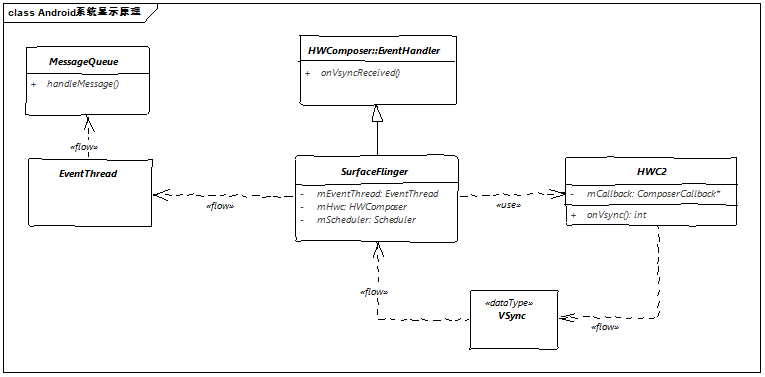

## 1. 关于`黄油计划（Project Buffer）`

Android 4.1 版本进行的UI流畅性优化， 重构了Android显示系统。其中包括三个核心元素：

1. **VSync**： （Vertical Synchronization ， 垂直同步机制） 是一种定时中断机制，包括软件和硬件两种生成方式。

2. **双缓冲机制**： 包括两个Framebuffer，分别是Front Buffer和Back Buffer, 前者用于渲染显示，Back 用于预绘制，而后两者交换。

   ​					 引入第三个buffer ----> Triple Buffer , 利用空闲的CPU时间。

3. **Choreography** ：调度单元，管理用户注册的回调并完成调度策略。


### 为什么引双缓冲机制？存在什么问题又是怎么改进的？


我们先看4张 2012 年google I/O大会图：

**1. 没有VSync信号**

   <center></center>

**2.  有VSync信号正常情况**


**3.  有VSync信号但GPU处理能力不足，16ms内未渲染完成**


**4.  三缓冲机制对情况三的优化**


四幅图中涉及到了三次优化，其最终目的都是如何更**有效的利用CPU和GPU资源**。

1. **双缓冲机制**的引入解决了单缓冲Screen Tearing现象的产生，也就是前后两帧画面各显示一部分。但这依然存在一个问题画面也就是`1图`绘制节奏的问题，可能CPU现在在处理其他任务，没来得及处理渲染下一阵画面，Back buffer 没准备好就只能显示前一帧画面，就出现了掉帧现象。
2. 问题在于优先级和绘制节奏，所以引入了**VSync信号机制**。VSync信号到来的时候就会启动下一帧的绘制工作，同时给主线程发送一个syncbarrier消息屏障，设置绘制动作为异步消息，以提高绘制的绝对优先级。但是在GPU或CPU处理能力不足的情况下，两个VSync信号间隔时间内完成不了渲染，但是两个Buffer又都被占用着。
3. **三缓冲机制**的引入缓解了这个问题， 当Vsync到来，但是Front Buffer 还在显示，Back Buffer依然在准备渲染数据的时候，就会使用Triple Buffer渲染下一帧数据，这事CPU和GPU会同时处理两帧数据，有效提高了资源利用率，减缓了掉帧现象。可以到`3图`中A、B两帧数据掉帧，而`4图`中由于三缓冲机制的引入B帧的数据得以正常显示。


## 2. SurfaceFlinger 的启动

### SurfaceFlinger 做了什么？ 


SurfaceFlinger 接受缓冲区，对它们进行合成，然后发送到屏幕。WindowManager 为 SurfaceFlinger 提供缓冲区和窗口元数据，而 SurfaceFlinger 可使用这些信息将 Surface 合成到屏幕。


### 1. init进程 ---> surfaceflinger.rc 

```c++  
//framework/native/services/surfaceflinger/surfaceflinger.rc 
service surfaceflinger /system/bin/surfaceflinger
```

### 2. 启动入口函数  --->main

```c++
// frameworks/native/services/surfaceflinger/main_surfaceflinger.cpp
int main(int, char**) {
    //1. 设置最大Binder线程池数4，并启动线程池
	// binder threads to 4.
    ProcessState::self()->setThreadPoolMaxThreadCount(4);
    // start the thread pool
    sp<ProcessState> ps(ProcessState::self());
    ps->startThreadPool();
    // 2. 创建surfaceflinger 对象并初始化，设置线程优先级为  PRIORITY_URGENT_DISPLAY（-4）
    // instantiate surfaceflinger
    sp<SurfaceFlinger> flinger = surfaceflinger::createSurfaceFlinger();
    setpriority(PRIO_PROCESS, 0, PRIORITY_URGENT_DISPLAY);
    // initialize before clients can connect
    flinger->init();     -----> // 
    
    // 3. 服务发布到 ServiceManager
     // publish surface flinger
    sp<IServiceManager> sm(defaultServiceManager());
    sm->addService(String16(SurfaceFlinger::getServiceName()), flinger, false,
                   IServiceManager::DUMP_FLAG_PRIORITY_CRITICAL | IServiceManager::DUMP_FLAG_PROTO);
    
    // 4. 执行启动入口
    // run surface flinger in this thread
    flinger->run();       ----> 

}
```

### 3. 强指针首次被引用的时候调用 --->//SurfaceFlinger::onFirstRef

```c++
void SurfaceFlinger::onFirstRef()
{
    mEventQueue->init(this); // ----> MessageQueue mEventQueue 
}
//frameworks/native/services/surfaceflinger/Scheduler
//初始化消息队列， MessageQueue中包括了消息队列和消息处理机制 
void MessageQueue::init(const sp<SurfaceFlinger>& flinger) {
    mFlinger = flinger;
    mLooper = new Looper(true);
    mHandler = new Handler(*this);
}

```


### 4.SurfaceFlinger初始化内容  // surfaceFlinger::init()

```c++
void SurfaceFlinger::init() { 
	//1. EventThread 的初始化
    mSfConnectionHandle = mScheduler->createConnection("sf", mPhaseOffsets->getCurrentSfOffset(),
                                                       resyncCallback, [this](nsecs_t timestamp) {
                                                           mInterceptor->saveVSyncEvent(timestamp);
                                                       });
                                                           
   // 2. 创建渲染引擎
    mCompositionEngine->setRenderEngine(renderengine::RenderEngine::create(static_cast<int32_t>(defaultCompositionPixelFormat),renderEngineFeature, maxFrameBufferAcquiredBuffers));
    // set initial conditions (e.g. unblank default device)
    //3.  初始化显示设备
    initializeDisplays();
    // 4. 初始化 HWComposer（Hardware  Compose硬件合成）  --> 联接了硬件层和SurfaceFlinger，是绘制的核心类。
    mCompositionEngine->setHwComposer(getFactory().createHWComposer(getBE().mHwcServiceName));
    
}
```


### 5. SurfaceFlinger 启动,进入Loop循环 等待消息   //SurfaceFlinger::run

```c++
void SurfaceFlinger::run() {
    do {
        waitForEvent();  // --> 
        //  mEventQueue->waitMessage();  
        //    ---> 进入epoll_wait() 等待消息
        //  do {
        //           IPCThreadState::self()->flushCommands();
        //           int32_t ret = mLooper->pollOnce(-1);
        //  }

    } while (true);
}


// 收到消息后 调用handleMessage  -->  SurfaceFlinger::onMessageReceived
void MessageQueue::Handler::handleMessage(const Message& message) {
    switch (message.what) {
        case INVALIDATE:
            android_atomic_and(~eventMaskInvalidate, &mEventMask);
            mQueue.mFlinger->onMessageReceived(message.what);
            break;
    }
}

```


## 3. VSync信号流向




1. VSync信号由HWC2 产生，并发送到SurfaceFlinger的onVsyncReceived方法
2. 由EventThread线程对Vsync信号进行入队操作
3. HandlerThread 在收到信息待处理的消息后，调用mFlinger->onMessageReceived(）


## 4. SurfaceFlinger 核心处理流程 ---->//handleMessageRefresh();

此时进入SurfaceFlinger的核心功能流程，在此先介绍下核心函数。

```c++
void SurfaceFlinger::onMessageReceived(int32_t what) NO_THREAD_SAFETY_ANALYSIS {
    ATRACE_CALL();
    switch (what) {
        case MessageQueue::INVALIDATE: {
            // ...
            //省略代码功能  1. 记录绘制状态和丢帧情况
            
            // 判断是否需要刷新
            bool refreshNeeded = handleMessageTransaction();
            refreshNeeded |= handleMessageInvalidate();

            updateCursorAsync();
            updateInputFlinger();
            
            refreshNeeded |= mRepaintEverything;
            if (refreshNeeded && CC_LIKELY(mBootStage != BootStage::BOOTLOADER)) {
                // Signal a refresh if a transaction modified the window state,
                // a new buffer was latched, or if HWC has requested a full
                // repaint
                // 这里执行刷新  -->  
                signalRefresh();
               //  ----> 
               //void MessageQueue::refresh() {
    		   //      mHandler->dispatchRefresh();   ----> 
			   //}
               //   最终 调用核心代码  handleMessageRefresh();

            }
        }
        case MessageQueue::REFRESH: {
            
            // ***核心代码***
            handleMessageRefresh();
            
            break;
        }
    }
}

```


